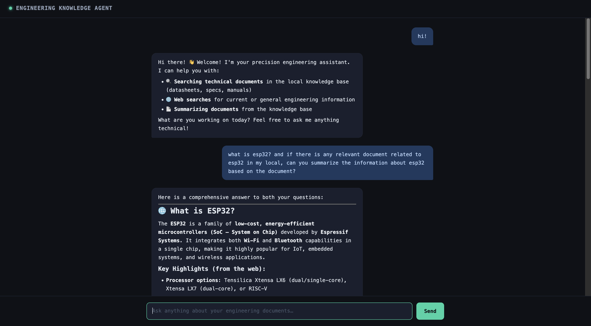

# 🤖 Personal Engineering Knowledge Agent

A RAG-powered AI agent that answers questions about your engineering documents — datasheets, research papers, technical specs — and searches the web when it needs to. Built with Python, FastAPI, ChromaDB, and the Anthropic API.



---

## What It Does

Drop any engineering document (PDF, text, markdown) into the `docs/` folder. Ask it anything. The agent decides whether to search your documents, search the web, or summarize a file — then answers with sources.

**Example questions it handles well:**
- *"What is the maximum operating voltage for this component?"* → searches your datasheets
- *"What are the latest developments in edge inference for embedded systems?"* → searches the web
- *"Give me an overview of the STM32 reference manual"* → summarizes the document

---

## Architecture

```
User (Browser)
     │
     ▼
FastAPI Server (server.py)
     │
     ▼
Agent Loop (agent.py)
     │
     ├── Tool: search_documents → ChromaDB (local vector DB)
     ├── Tool: search_web       → Tavily Search API
     └── Tool: summarize_document → full document load + Claude summary
     │
     ▼
Claude (claude-sonnet-4-6) — reasoning, tool selection, final answer
```

The agent uses Claude's tool-calling API to autonomously decide which tool to invoke based on the question. It loops until it has enough context to give a grounded answer.

---

## Tech Stack

| Layer | Technology |
|---|---|
| Language | Python 3.10+ |
| LLM | Anthropic API (`claude-sonnet-4-6`) |
| Vector DB | ChromaDB (local) |
| Web Search | Tavily API |
| Backend | FastAPI + Uvicorn |
| Frontend | Vanilla HTML/CSS/JS + marked.js |

---

## Project Structure

```
knowledge-agent/
├── ingest.py           # Document ingestion pipeline
├── agent.py            # Agent loop with tool-calling
├── tools.py            # Tool definitions and implementations
├── query.py            # CLI query interface
├── server.py           # FastAPI backend
├── static/
│   └── index.html      # Chat UI
├── utils.py            # Shared helpers
├── requirements.txt
└── docs/               # Drop your documents here
```

---

## Getting Started

### 1. Clone and install

```bash
git clone https://github.com/seointhenerd/knowledge-agent.git
cd knowledge-agent
pip3 install -r requirements.txt
```

### 2. Set up environment variables

Create a `.env` file in the project root:

```
ANTHROPIC_API_KEY=your_anthropic_api_key
TAVILY_API_KEY=your_tavily_api_key
```

- Get your Anthropic API key at [console.anthropic.com](https://console.anthropic.com)
- Get your free Tavily API key at [tavily.com](https://tavily.com) (1,000 free searches/month)

### 3. Ingest your documents

```bash
python3 ingest.py docs/
```

Supports PDF, plain text, and markdown files.

### 4. Run the web app

```bash
uvicorn server:app --reload
```

Open [http://localhost:8000](http://localhost:8000) in your browser.

### 5. Or use the CLI

```bash
python3 query.py "What is the max voltage rating?"
```

---

## Features

- **RAG pipeline** — chunks and embeds documents into a local ChromaDB vector store for semantic search
- **Tool-calling agent** — Claude autonomously selects tools based on the question; no hardcoded routing
- **Web search fallback** — Tavily integration for questions that go beyond your local documents
- **Document summarization** — full-file summarization on demand
- **Observable** — every request logs question, tools used, answer, and latency to terminal
- **Clean chat UI** — dark theme, markdown rendering, tool tags on each response, copy-on-hover

---

## API Reference

### `POST /chat`

```json
// Request
{ "question": "What is the max voltage of this component?" }

// Response
{
  "answer": "Based on the datasheet, the maximum operating voltage is...",
  "tools_used": ["search_documents"]
}
```

### `GET /health`

```json
{ "status": "ok" }
```

---

## What I Learned

- How RAG systems work end-to-end: chunking, embedding, retrieval, context injection
- How to implement an agent loop using Claude's tool-calling API
- FastAPI basics: routing, request/response models, serving static files
- CSS flexbox debugging (user bubble alignment — wrapper width collapse is a real gotcha)
- Importance of observability even in small projects: logging latency and tool usage makes debugging dramatically easier